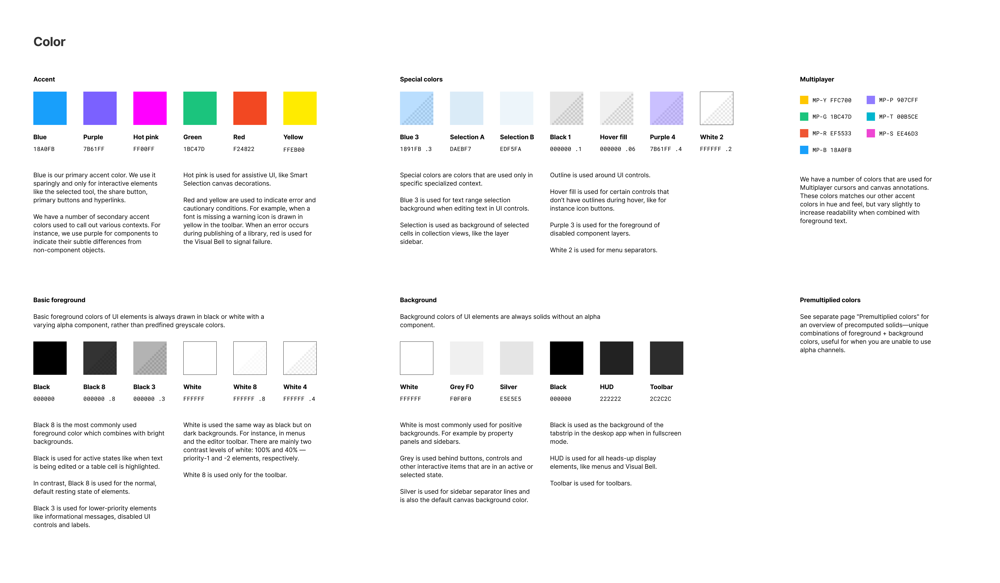
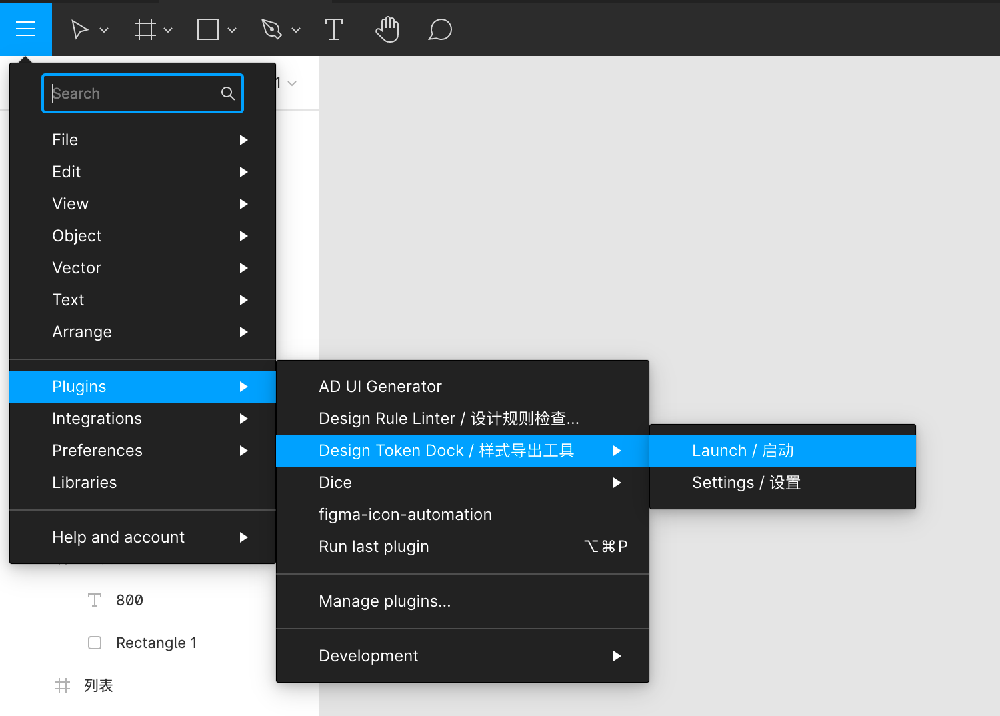
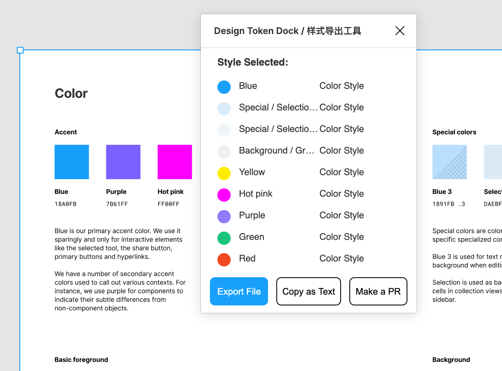
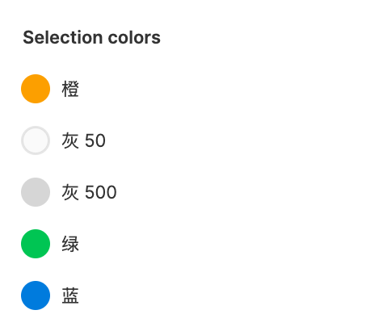

# Design Token Dock

本 figma 插件用于导出 figma 样式为 JSON 格式。支持导出方式：

- 直接复制
- 下载保存为 .json 文件
- 发起 Github PR

[Figma Plugin Link 🔗](https://www.figma.com/community/plugin/903167004921142962/Design-Token-Dock-%2F-%E6%A0%B7%E5%BC%8F%E5%AF%BC%E5%87%BA%E5%B7%A5%E5%85%B7)

## 背景

- Design Token 是什么？

  设计师通常在进行网页设计前，会定义一套[设计系统](https://uxdesign.cc/everything-you-need-to-know-about-design-systems-54b109851969)。通常设计系统包含色盘、分级别的字体字号行高、边距规范、符号 icon 等等。在后续的设计中，设计稿会遵循设计系统的规范，从而保持一致性。

  例 [figma ui](https://www.figma.com/community/file/928108847914589057/UI2%3A-Figma's-Design-System) 设计系统中的色盘定义:
  

  web 开发者在开发时，会将设计系统定义为 css 变量、scss 变量、js 变量等等形式进行引用。这些根据设计系统定义的一些程序变量可以理解为 **Design Token**。

  例 定义在css变量中的 design-token:

  ```css
  :root {
    --theme-blue: #18a0fb;
    --theme-purple: #7b61ff;
    --sm-font-size: 14px;
    --md-font-size: 16px;
    --lg-font-size: 20px;
  }
  ```

- Design Token & Figma

  开发者手动编写 Design Token 的过程是非常枯燥的，且容易出错。如果可以从设计师使用的设计工具中直接导出 token，是省事又省力的。正好 figma 支持用户定义 [style](https://help.figma.com/hc/en-us/articles/360039238753-Styles-in-Figma)，我就编写了这个插件，能够将 figma 样式自动导出 Design Token JSON 文件。
  
  除了通常的导出文件之外，本插件还支持发起 github pull request。可以写一些 github action 脚本，来实现 design token npm 包发布的自动化:

  ```yml
  on:
  pull_request:
    types: [ closed ]

  jobs:
    merge_job:
      # 监控 pull request merged 事件，执行 action 任务
      if: github.event.pull_request.merged == true
      steps:
      - run: echo PR ${{ github.event.number }} has been merged
      # body 中存放了 design token 数据
      - run: echo PR Issue body '${{ github.event.pull_request.body }}'
      # .
  ```

  具体例子可以参考: [adui design token](https://github.com/ExcitedSpider/adui-design-token/blob/master/.github/workflows/pr-merged.yml)。该 design token 库通过本插件实现了直接发布 design token npm 包。 

## 安装

从 [figma community](https://www.figma.com/community/plugin/903167004921142962/Design-Token-Dock-%2F-%E6%A0%B7%E5%BC%8F%E5%AF%BC%E5%87%BA%E5%B7%A5%E5%85%B7) 中安装。

## 使用

1. 从右上角菜单栏启动插件
  

2. 选择一些包含 figma style 的节点
  

3. 选择一种导出方式即可导出 json

### token 命名问题

插件默认以 style 的名称对 token 命名。然而很多时候 style 的命名是设计师做的，不能够符合程序中的命名规范:



对于这个问题，本插件还支持配置命名来源为 style description。从菜单中选择插件的设置即可:


通过figma style配置description字段即可。插件导出的 token 将会取该字段。如果该样式description字段为空，将会以 style id 来命名。


### Github Pull Request

将 token 导出为 pull request，可以通过 github actions 等方式实现更高程度的自动化。

1. 需要首先在设置页面配置 github access token。获取方式可以参考 [github 文档](https://docs.github.com/en/free-pro-team@latest/github/authenticating-to-github/creating-a-personal-access-token)

  

2. 在选择样式之后，点击 Make a PR 按钮进入 PR 发起页面。填写对应的 repo 和 version (package.json version 字段)。即可点击确认发起 PR。

  

## 还有问题？

- 在 [github issues](https://github.com/ExcitedSpider/figma-design-token-dock/issues/new) 提问

## 开发

1. clone & install

```bash
npm i
npm run start
```

2. load `manifest.json` in figma desktop
